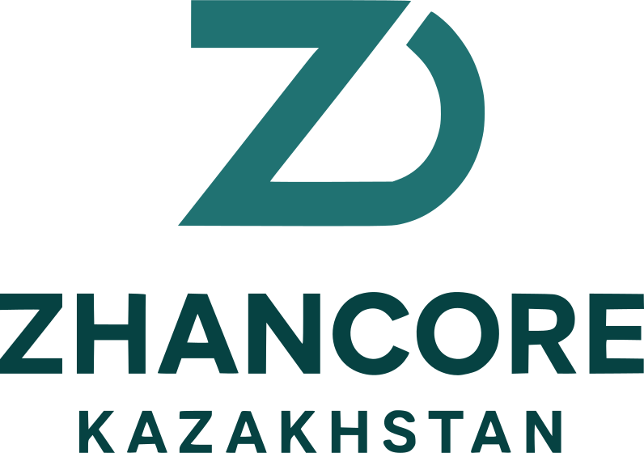

# Zhancore CRM System

## 🧭 Project Overview

**Zhancore** — это компания, ориентированная на индивидуальную разработку программных решений.
Наша главная особенность — **клиент оплачивает только один раз**, без обязательных подписок и скрытых платежей. Мы считаем, что вы должны **владеть продуктами, которые покупаете**.

---

## 🚀 Current Stage

На данный момент мы разрабатываем внутреннюю CRM-систему для автоматизации бизнес-процессов компании Zhancore.
Текущая стадия разработки — сдача проекта в рамках курса по Vue.js.

---

## 🏗️ Architecture Overview

Проект построен по **микросервисной архитектуре** с использованием **IPA Gateway** и поддержкой **Microfrontend-паттерна**.
Сервисы разделены по зонам ответственности и взаимодействуют через REST API.

### Features

* Микросервисная архитектура
* Возможность микрофронтенда
* Чат с интеграцией в **WhatsApp** и **Telegram**
* Аутентификация через **OAuth2 (Google)**
* Ролевая система доступа (**RBAC**)
* Централизованное логирование
* Интеграция с **email-сервисом**
* Генерация документов через **LaTeX**

---

## 🧩 Services

| Сервис                        | Технологии          | Назначение                                                  |
| ----------------------------- | ------------------- | ----------------------------------------------------------- |
| **User-service**              | Golang, PostgreSQL  | Управление пользователями, авторизация и роли               |
| **CRM-backend**               | ASP.NET, PostgreSQL | Основная логика CRM (Client → Lead → Opportunity → Project) |
| **Landing-page-backend**      | Laravel, MySQL      | Обработка данных с лендинга и создание клиентов             |
| **Chat-service**              | Node.js, MongoDB    | Реализация чата и уведомлений                               |
| **WA-integration-service**    | —                   | Интеграция с WhatsApp API                                   |
| **TG-integration-service**    | —                   | Интеграция с Telegram API                                   |
| **Email-service**             | —                   | Отправка уведомлений и писем                                |
| **Contact-validator-service** | —                   | Проверка корректности контактных данных                     |
| **Document-generate-service** | LaTeX               | Автоматическая генерация договоров и документов             |

---

## 💻 Frontend Applications

| Приложение                 | Технологии                     | Описание                                                                                                   |
| -------------------------- | ------------------------------ | ---------------------------------------------------------------------------------------------------------- |
| **Landing Page**           | Vue.js, Laravel                | Визитка компании Zhancore. Цель — привлечение клиентов. Содержит форму обратной связи для получения услуг. |
| **Login Page**             | Vue.js, Go (User-service)      | Авторизация и аутентификация пользователей                                                                 |
| **Approval Page**          | Vue.js                         | Панель согласования сделок (Opp) менеджерами                                                               |
| **Admin Page (Dashboard)** | Vue.js, Node.js *(deprecated)* | Внутренний интерфейс для мониторинга и тестирования                                                        |
| **CRM App**                | Vue.js, ASP.NET                | Основное приложение для управления клиентами, лидами и проектами                                           |

---

## ⚙️ CRM Process

CRM система Zhancore основана на **четырех сущностях**, каждая из которых отражает определенный этап взаимодействия с клиентом:

**1. Client**
Создается автоматически из формы на Landing Page.
Статусы: `active`, `inactive`.

**2. Lead (Потенциальный клиент)**
Создается из Client после Landing Page или вручную консультантом.
Статусы: `new`, `demo`, `lost`, `won`, `not serious`.

**3. Opportunity (Сделка)**
Формируется из Lead после квалификации.
Статусы:
`сбор требований`, `составление договора`, `согласование руководства`, `согласование заказчика`, `подписание`, `lost`, `won`.

**4. Project (Проект)**
Создается из Opportunity после выигрыша сделки.
Статусы:
`ожидание оплаты`, `в работе`, `сдача заказчику`, `поддержка`, `closed`.

---

## 👥 Roles and Permissions

| Роль           | Описание                                           |
| -------------- | -------------------------------------------------- |
| **SysAdmin**   | Администрирование базы данных и инфраструктуры     |
| **CRMAdmin**   | Управление сущностями CRM, пользователями и ролями |
| **Consultant** | Работа с клиентами и лидами                        |
| **Manager**    | Проверка и апрув сделок (Opportunities)            |

---

## 📖 User Story Example

1. Клиент заходит на **Landing Page** и оставляет контактные данные.
2. Система создает новую запись **Client** и передает информацию в **CRM**.
3. Консультант анализирует клиента и создает **Lead**.
4. После переговоров лид квалифицируется в **Opportunity**.
5. Менеджер проверяет и утверждает сделку.
6. После подписания создается **Project**, который проходит этапы реализации.

---

## 🧠 Tech Stack Summary

### Frontend

* Vue.js
* SCSS

### Backend

* Node.js
* Express.js
* ASP.NET
* Laravel
* Golang

### Databases

* PostgreSQL
* MySQL
* MongoDB

---

## 👨‍💻 Team

* **Zhumagulov Arlan**
* **Amangeldi Zhanserik**
* **Zhumadildinov Ilias**